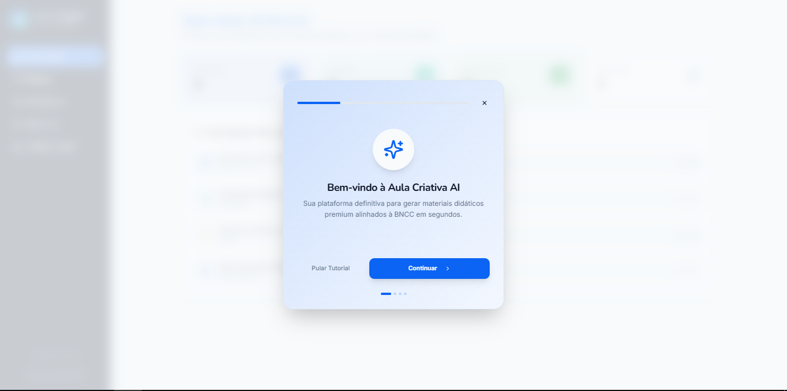

# 🚀 Portfólio Pessoal — Douglas Leone



> **Portfólio Pessoal** focado em transmitir credibilidade, maturidade técnica e organização. Projetado para apresentar habilidades em **Desenvolvimento Back-end**, **Arquitetura de Software**, **APIs RESTful**, **Automações de Processos** e **Inteligência Artificial Aplicada**.

---

## 🌟 Sobre o Desenvolvedor

**Douglas Leone**
* 🎓 Graduando em Análise e Desenvolvimento de Sistemas (IFPI Campus Piripiri)
* 💼 Foco: Desenvolvedor Back-end & Arquitetura de Software
* 🛠️ Habilidades principais: TypeScript, Node.js, C#, PostgreSQL, Supabase, Python, React e Docker.
* 🔗 **LinkedIn:** [https://www.linkedin.com/in/douglas-leone-713a94376/](https://www.linkedin.com/in/douglas-leone-713a94376/)
* 🐙 **GitHub:** [https://github.com/DouglasLeone/](https://github.com/DouglasLeone/)
* 📱 **WhatsApp:** [(86) 99945-5452](https://wa.me/5586999455452)

---

## 🛠️ Tecnologias & Arquitetura do Projeto

* **Core:** HTML5 Semântico, CSS3 Moderno (Vanilla CSS), JavaScript ES6+
* **Identidade Visual:** Dark Theme com acentos em Roxo (`#a855f7`) e Índigo (`#6366f1`)
* **Tipografia:** Plus Jakarta Sans & Fira Code (Google Fonts)
* **Ícones:** FontAwesome 6 & Devicon (Ícones oficiais coloridos em HD)
* **Animações:** Keyframes CSS (`@keyframes floatAnim`), Transitions fluidas e `IntersectionObserver` para scroll
* **APIs em Tempo Real:** Integração direta com a API pública do GitHub (`https://api.github.com/users/DouglasLeone`)

---

## 📁 Estrutura de Pastas

```text
Portfólio_Pessoal/
├── images/
│   ├── Aula-Criativa-AI.png    # Screenshot do projeto Aula Criativa AI (Hackathon)
│   └── MailWatch.png           # Screenshot do projeto MailWatch (Hackathon)
├── index.html                  # Estrutura HTML5 semântica e acessível com JSON-LD
├── styles.css                  # Sistema de design responsivo, variáveis CSS e animações
├── script.js                   # Lógica JS, busca de API do GitHub e manipulador do formulário
├── README.md                   # Documentação completa do projeto
└── .gitignore                  # Arquivos ignorados pelo Git
```

---

## 💻 Projetos em Destaque

### 1. 🤖 [Aula Criativa AI — Assistente Pedagógico BNCC](https://github.com/DouglasLeone/Hackathon-Cultura-Digital-BNCC)
Assistente inteligente para auxílio de professores no planejamento docente, gerando planos de aula automáticos e roteiros de slides 100% alinhados à BNCC.
* **Stack:** React 18, Vite 7, TypeScript, Tailwind CSS, Shadcn UI, Firebase, Gemini AI API.

### 2. 📧 [MailWatch — Gestão Inteligente de E-mails](https://github.com/DouglasLeone/MailWatch)
Solução desenvolvida no Hackathon IFPI para captura de e-mails via Mailgun (CC), classificação com IA e triagem automatizada.
* **Stack:** Node.js, Express, TypeScript, Mailgun API, Gemini AI.

---

## 🚀 Como Executar Localmente

Nenhum compilador ou build complexo é necessário! O projeto roda em qualquer servidor web estático.

### Opção 1: VS Code Live Server
Abra a pasta do projeto no VS Code e clique em **"Go Live"**.

### Opção 2: Python (Terminal)
```bash
python -m http.server 8080
```
Acesse no navegador: `http://localhost:8080`

---

## 📄 Licença

Este projeto é de propriedade de **Douglas Leone**. Fique à vontade para usar como inspiração para seu próprio portfólio!
